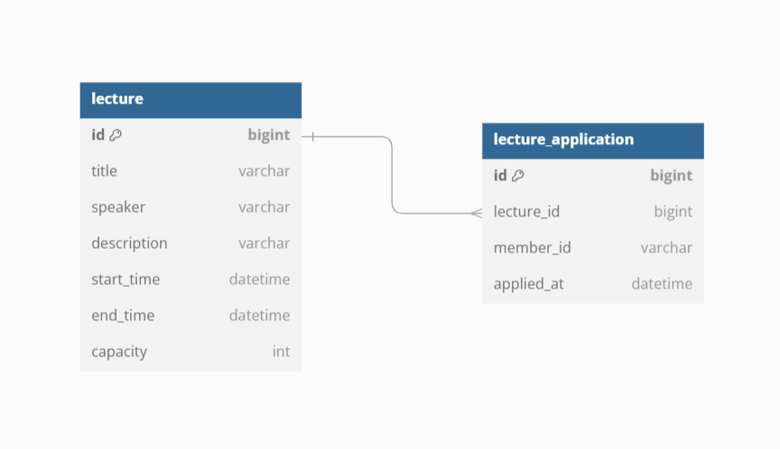

## ERD

### Lecture 
- 강의 정보를 관리하는 테이블로, 강의의 기본 정보(제목, 강연자, 시작 시간 등)와 신청 가능한 정원(capacity)을 포함합니다.
### Lecture_Application
- 강의 신청 정보를 관리하는 테이블로, 특정 강의를 신청한 회원의 정보를 기록합니다.
---

### ERD 설계 고민

**1. `member` 테이블 생략**

과제에서는 로그인/회원가입 기능을 제공하지 않고, 이미 가입된 회원이 서비스에 참여한다고 가정하여 특강 / 특강 신청 목록 테이블만 작성했습니다.
- 회원 테이블이 추가되는 경우, Lecture_Application의 member_id 와 연결하여 확장할 수 있습니다.

**2. `capacity` 컬럼에 대한 고민**

- 동시성 문제: capacity 컬럼을 통해 정원을 관리할 경우, 동시성 이슈로 인해 데이터 정합성 문제가 발생할 가능성이 있습니다.
- 대안: 사용자가 많지 않은 경우, 별도의 컬럼 없이 Lecture_Application 테이블의 row 개수를 조회하는 방식으로 대체할 수 있습니다.

row 개수를 조회하는 방식은 매번 row 개수를 조회해야 하기 때문에 추가적인 쿼리 비용이 발생할 수 있습니다.
서비스 특성상 동시성이 높을 것이라 예상되고, 컬럼 기반 관리가 더 유리하다고 생각해 추가하였습니다.

**3. `lecture_application` 테이블 비정규화**

쓰기 연산보다 읽기 연산이 보편적으로 더 많은 것으로 알고 있습니다.
정규화된 구조는 lecture_application 조회 시마다 join 연산을 발생시켜 성능에 영향을 줄 수 있습니다.

그렇다고 비정규화를 하게 된다면 관리해야할 코드가 많아져 복잡성이 높아질 것이라 생각되었습니다. 
코드 복잡성을 낮추기 위해 정규화 방식을 선택했습니다.

